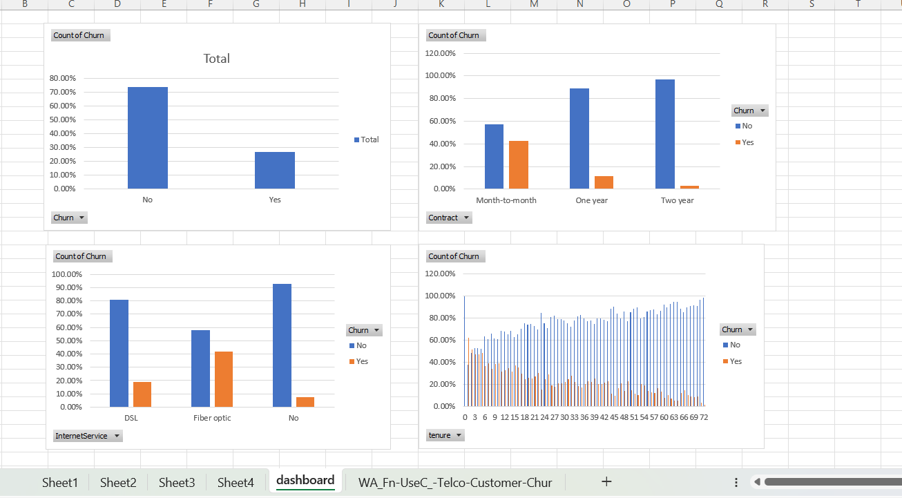
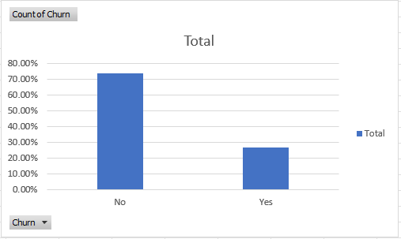
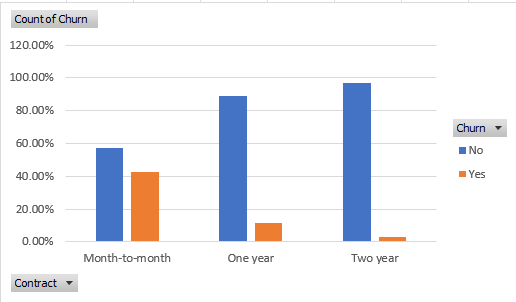
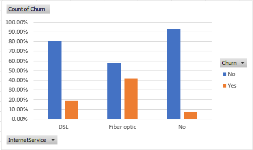
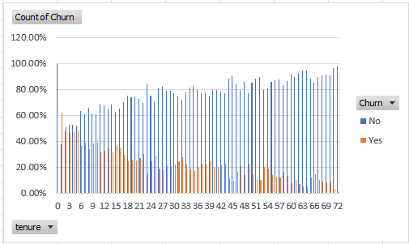

# FUTURE_DS_02
Customer Retention &amp; Churn Analysis using Excel - Future Interns Data Science &amp; Analytics 
Task 2

## 🎯 Objective
Analyze customer churn patterns and identify key factors affecting customer retention.

---

## 🛠 Tools Used
- Microsoft Excel
- Pivot Tables
- Charts

---

## 📊 Key Analysis
- Churn rate analysis
- Customer segmentation
- Cohort behavior
- Retention trends

---

## 🔍 Insights
- Certain customer groups have higher churn rates
- Engagement level affects retention
- Service usage impacts churn behavior

---

## 💡 Conclusion
This analysis helps businesses reduce customer churn and improve retention strategies.

## 📊 Dashboard Preview

### Full Dashboard

### Churn Analysis

### Contract Analysis

### Internet Service Analysis

### Tenure Analysis

